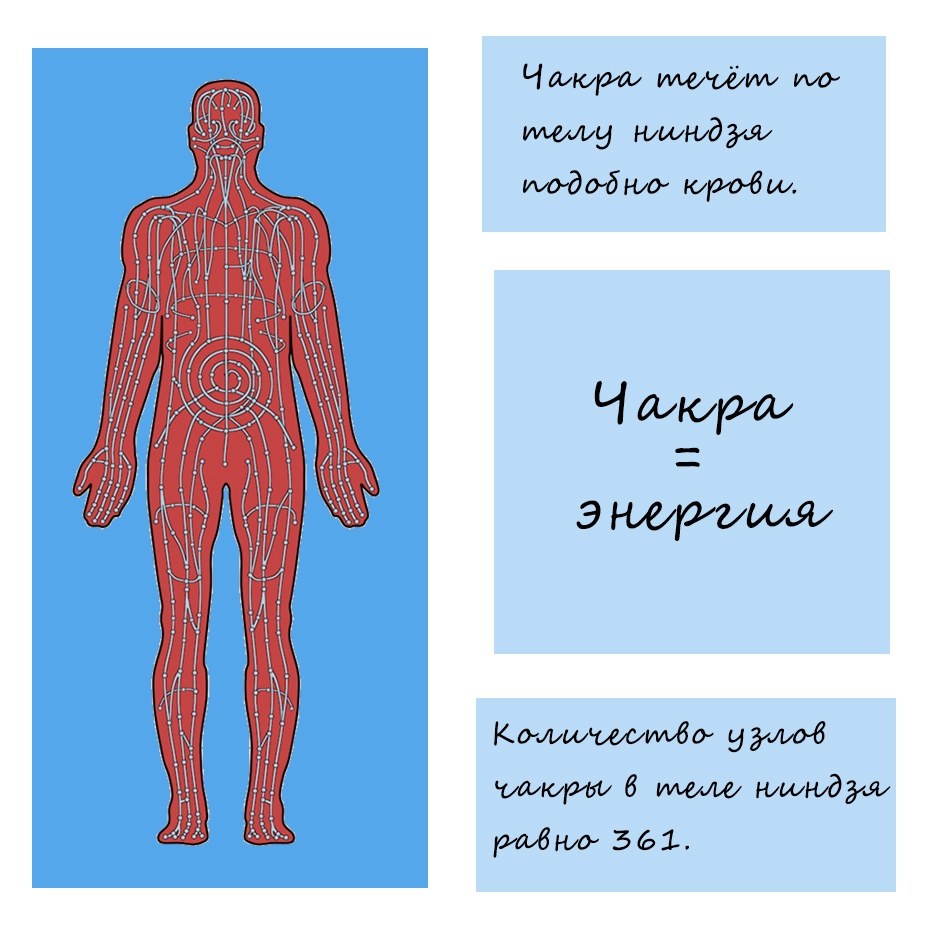

# 🏥 Медицинский Корпус Конохи — Руководство для разработчиков

## 📋 О проекте

Сайт для GMod Naruto Roleplay сервера на медицинскую тематику. Выполнен в тёмной стилистике с зелёными акцентами и элементами стиля Наруто (свитки, иероглифы).

---

## 🗂️ Структура проекта

```
Med/
├── index.html              # Главная страница (баннер + 3 карточки-навигации)
├── sostav.html             # Страница "Состав" (таблицы состава + модалки)
├── tehniki.html            # Страница "Техники Мед Корпуса" (карточки техник)
├── reglamenty.html         # Страница "Регламенты" (карточки-навигация)
├── reglament-obshchiy.html # Регламент: Общий Свод Правил Больницы Конохи
├── reglament-operacii.html # Регламент: Проведение хирургических операций
├── reglament-sluzhba.html  # Регламент: Положение о службе и профессиональном развитии
├── lekcii.html             # Страница "Лекции" (карточки-навигация)
├── lekciya-01.html         # Лекция № 01: Анатомия шиноби
├── lecture1/               # Фотографии для Лекции № 01
│   └── README.md           # Пояснение к папке
├── lecture2/               # Фотографии для Лекции № 02
│   └── README.md           # Пояснение к папке
├── css/
│   └── style.css           # Все стили сайта (~2100 строк)
├── js/
│   └── main.js             # JavaScript (прелоадер, навигация, анимации, модалки)
├── images/
│   ├── med.png             # Баннер на главной
│   ├── icon.png            # Favicon (иконка вкладки браузера)
│   ├── *.jpg               # Изображения техник (17 шт.)
│   └── lecture-anatomy.jpg # Иконка для карточки Лекции № 01
└── GUIDE.md                # Этот файл
```

---

## 🚀 Быстрый старт

### Как запустить сайт
Просто откройте `index.html` в браузере. Никаких сборщиков, зависимостей или серверов не требуется.

### Как открыть сайт
```
start index.html
```

### Что нужно знать перед началом работы
1. **Все стили** — в одном файле `css/style.css` (~2100 строк)
2. **Весь JavaScript** — в одном файле `js/main.js` (~400 строк)
3. **Каждая страница** — отдельный `.html` файл с одинаковой структурой: прелоадер → header → контент → footer
4. **Никаких фреймворков** — чистый HTML/CSS/JS
5. **Иконки** — Font Awesome 6.5.0 (бесплатная версия, НЕ использовать Pro-иконки)
6. **Шрифты** — Montserrat + Noto Sans JP (Google Fonts)
7. **Favicon** — единая иконка вкладки `images/icon.png` на всех страницах

### Чек-лист при создании новой страницы
- [ ] Скопировать существующий `.html` файл
- [ ] Вставить прелоадер сразу после `<body>`
- [ ] Обновить `<title>` и `<meta description>`
- [ ] Добавить favicon: `<link rel="icon" type="image/png" href="images/icon.png">`
- [ ] Поставить класс `active` на нужный пункт меню
- [ ] Обновить `.page-header__title` и `.page-header__subtitle`
- [ ] Добавить контент в `<section class="section">`
- [ ] Добавить `fade-in` классы к элементам
- [ ] Проверить адаптивность (мобильные <480px, планшеты <768px)
- [ ] Обновить навигацию во **всех** HTML-файлах

---

## 🖼️ Favicon (иконка вкладки)

На всех страницах сайта используется единая иконка вкладки браузера — `images/icon.png`.

### Как подключить
Вставьте в `<head>` сразу после `<meta name="description">`:

```html
<link rel="icon" type="image/png" href="images/icon.png">
```

### Правила
1. **Favicon обязателен на каждой странице** — при создании новой страницы не забудьте добавить эту строку
2. Файл `icon.png` лежит в `images/` — не перемещайте и не переименовывайте его
3. Если нужно заменить иконку — просто замените файл `images/icon.png` (рекомендуемый размер 64x64 или 128x128)

---

## 📋 Текущее состояние сайта

### ✅ Готово
| Страница | Статус |
|----------|--------|
| `index.html` | Главная с баннером и 3 карточками-навигацией |
| `sostav.html` | Состав: руководство, 3 таблицы, модалки участников |
| `tehniki.html` | 17 техник в 4 категориях, модалка техники |
| `reglamenty.html` | Навигация по регламентам (карточки-кнопки) |
| `reglament-obshchiy.html` | Общий Свод Правил Больницы Конохи |
| `reglament-operacii.html` | Регламент Проведения Операций |
| `reglament-sluzhba.html` | Положение о Службе и Профессиональном Развитии |
| `lekcii.html` | Навигация по лекциям (карточки-кнопки) |
| `lekciya-01.html` | Лекция № 01: Анатомия шиноби |
| Прелоадер | На всех страницах, при загрузке и переходах |
| Favicon | На всех страницах (`images/icon.png`) |

### 🔜 Возможные задачи для продолжения
- Добавить новые регламенты (по шаблону из раздела «Регламенты»)
- Добавить новые техники (по шаблону из раздела «Техники»)
- Обновить состав (добавить/убрать участников в таблицах)
- Добавить страницу «Новости» или «События»
- Добавить страницу «Правила сервера»
- Добавить форму заявки в корпус (сейчас кнопка «Подать заявку» ведёт на `#`)

---

## 🎨 Цветовая схема (CSS Variables)

Все цвета заданы в `:root` в `css/style.css`:

```css
--primary: #0d0d0d;        /* Основной чёрный */
--primary-dark: #000000;    /* Абсолютно чёрный */
--primary-light: #2a2a2a;  /* Светло-чёрный для карточек */
--accent: #1b5e20;         /* Тёмно-зелёный (кнопки, рамки) */
--accent-light: #2e7d32;   /* Светло-зелёный (hover) */
--accent-glow: #4caf50;    /* Зелёное свечение (иконки, активные ссылки) */
--bg-light: #121212;       /* Фон страницы */
--bg-white: #1a1a1a;       /* Фон карточек */
--text-dark: #e0e0e0;      /* Основной текст (светлый) */
--text-muted: #9e9e9e;     /* Приглушённый текст */
```

### Дополнительные цвета для разделов техник

| Раздел | Цвет | CSS-класс |
|--------|------|-----------|
| Основные медицинские | Оранжевый `#ff9800` | `--mechanical` |
| Медицинское тайдзюцу | Красный `#ef5350` | `--taijutsu` |
| Скальпель чакры | Голубой `#4dd0e1` | `--scalpel` |
| Ролевые | Фиолетовый `#ce93d8` | `--roleplay` |

---

## 📄 Как создать новую страницу

1. Скопируйте любой существующий `.html` файл (например `sostav.html`)
2. Измените:
   - `<title>` — заголовок вкладки
   - `class="nav__link active"` — перенесите `active` на нужный пункт меню
   - `.page-header__title` — заголовок страницы
   - `.page-header__subtitle` — подзаголовок
   - Контент внутри `<section class="section">`

### Пример навигации с активной страницей:

```html
<ul class="nav__links">
    <li><a href="index.html" class="nav__link">Главная</a></li>
    <li><a href="sostav.html" class="nav__link">Состав</a></li>
    <li><a href="tehniki.html" class="nav__link active">Техники</a></li>  <!-- active здесь -->
    <li><a href="reglamenty.html" class="nav__link">Регламенты</a></li>
</ul>
```

---

## 🧩 Компоненты

### Карточка (about__card)
Используется для блоков с иконкой, заголовком и текстом. Автоматически кликабельная, если обёрнута в `<a>`.

```html
<a href="page.html" class="about__card" style="display: block; text-decoration: none;">
    <div class="about__card-icon">
        <i class="fas fa-users"></i>  <!-- Иконка Font Awesome -->
    </div>
    <h3>Заголовок</h3>
    <p>Описание текст...</p>
</a>
```

### Заголовок секции
```html
<h2 class="section__title">
    <i class="fas fa-icon section__title-icon"></i>
    Название секции
</h2>
<p class="section__subtitle">Подзаголовок</p>
```

### Кнопка
```html
<a href="page.html" class="nav-card__btn">Текст кнопки</a>
```

### Анимация появления (fade-in)
Добавьте класс `fade-in` к любому элементу, и он плавно появится при скролле:

```html
<div class="fade-in">Контент</div>
```

---

## 📜 Свиток-контейнер (Scroll Container)

Контейнер в стиле Наруто — используется для таблиц состава. Выглядит как свиток с иероглифами по углам.

```html
<div class="scroll-container">
    <span class="scroll-ornament scroll-ornament--tl">巻物</span>
    <span class="scroll-ornament scroll-ornament--tr">医者</span>
    <span class="scroll-ornament scroll-ornament--bl">部隊</span>
    <span class="scroll-ornament scroll-ornament--br">名簿</span>

    <!-- контент -->
</div>
```

Варианты иероглифов для орнаментов:
- `巻物` — свиток
- `医者` — врач
- `部隊` — отряд
- `名簿` — список имён
- `外科` — хирургия
- `手術` — операция
- `技術` — техника
- `一覧` — список
- `体術` — тайдзюцу
- `医療` — медицина
- `達人` — мастер

---

## 🏛️ Карточки руководства (Leadership Cards)

Используются для отображения Главы и Зама. Кликабельны — открывают модальное окно.

```html
<div class="leadership-card"
     data-name="Имя Персонажа"
     data-rank="Медицинский ранг"
     data-position="Должность"
     data-kanji="Иероглифы"
     data-clan="Клан"
     data-discord="discord_ник">
    <div class="leadership-card__icon">
        <i class="fas fa-user-md"></i>
    </div>
    <div class="leadership-card__role">Роль в корпусе</div>
    <div class="leadership-card__name">Имя Персонажа</div>
    <div class="leadership-card__kanji">院長</div>
</div>
```

**Важно:** 
- `data-kanji` — только для руководства (院長/副院長)
- `data-position` — не делайте слишком длинным, иначе может съехать
- `data-rank` — только медицинские ранги (Глав Врач, Заместитель Глав Врача и т.д.)

---

## 📊 Таблицы состава (Composition Tables)

Три таблицы на странице `sostav.html`:
1. **Основной состав** — 20 мест (строки: ранг + должность + навыки)
2. **Владельцы Техники Скальпеля** — 10 мест
3. **Владеющие Медицинским Тайдзюцу** — 10 мест

### Структура строки таблицы

Каждая активная строка содержит data-атрибуты для модального окна:

```html
<tr data-name="Имя" 
    data-rank="Медицинский ранг" 
    data-position="Должность"
    data-clan="Клан" 
    data-note="Заметка (если есть)" 
    data-discord="discord_ник">
    <td><span class="table-num">#</span></td>
    <td><span class="table-name">Имя</span></td>
    <td>
        <span class="spec-badge">Медик</span> 
        <span class="spec-badge surgeon">Хирург</span>
    </td>
    <td><span class="status-badge active"><i class="fas fa-circle"></i> Активен</span></td>
</tr>
```

### Бейджи (spec-badge)

Цветовая маркировка бейджей в колонке "Должность":

| Цвет | Класс | Для чего |
|------|-------|----------|
| Зелёный | `spec-badge` | Медицинские ранги (Медик, Интерн) |
| Зелёный | `spec-badge intern` | Интерны |
| Красный | `spec-badge surgeon` | Хирурги |
| Золотой | inline-стили | Владение Скальпелем |
| Фиолетовый | inline-стили | Медицинское Тайдзюцу |
| Оранжевый | inline-стили | Особые должности (Капитан ВП, Глава Клана, Глава Академии) |

Пример кастомного бейджа:
```html
<span class="spec-badge" style="background: rgba(255, 215, 0, 0.1); color: #ffd700; border-color: rgba(255, 215, 0, 0.15);">Скальпель</span>
```

### Вакантные строки

```html
<tr class="vacant-row">
    <td><span class="table-num">#</span></td>
    <td><span class="table-name">—</span></td>
    <td><span class="spec-badge" style="background: transparent; color: var(--text-muted); border: 1px dashed rgba(255,255,255,0.08);">—</span></td>
    <td><span class="status-badge vacant"><i class="fas fa-clock"></i> Вакансия</span></td>
</tr>
```

### Счётчик занятых мест

```html
<span class="table-header__count">
    <i class="fas fa-users"></i> 11 / 20 мест
</span>
```

---

## 🪟 Модальное окно участника (Member Modal)

Открывается при клике на любую активную строку таблицы или карточку руководства.

**Поля модалки:**
- **Ранг** (`data-rank`) — медицинский ранг (Интерн, Медик, Глав Врач и т.д.)
- **Должность** (`data-position`) — род деятельности (Хирург, Фармацевт, Глава Клана и т.д.)
- **Клан** (`data-clan`) — клан персонажа или "Нет"
- **Заметка** (`data-note`) — показывается только если не пустая
- **Discord** (`data-discord`) — ник для связи, отображается с @

**Ранги должны быть ТОЛЬКО медицинскими:**
- `Интерн` — младший сотрудник
- `Медик` — полноценный медик
- `Старший Медик` — опытный медик
- `Глав Врач` — глава корпуса
- `Заместитель Глав Врача` — замглавы

**Должности** — это род деятельности, а не ранг:
- Хирург, Фармацевт, Глава Клана, Капитан ВП и т.д.

---

## 🃏 Карточки техник (Technique Cards) — tehniki.html

Страница `tehniki.html` отображает список медицинских техник, разделённых на **4 категории**.

### 🎯 Концепция

Каждая техника представлена **компактной карточкой-превью**. При клике открывается **модальное окно** с полной информацией (видео, изображение, описание, характеристики, ранг).

Ранг техники **не показывается на карточке** — он виден только внутри модального окна.

### 🔀 Разделители категорий (Technique Divider)

```html
<!-- Основные медицинские (оранжевый) -->
<div class="technique-divider fade-in">
    <span class="technique-divider__line"></span>
    <span class="technique-divider__label technique-divider__label--mechanical">
        <i class="fas fa-notes-medical"></i> Основные медицинские
    </span>
    <span class="technique-divider__line"></span>
</div>

<!-- Медицинское тайдзюцу (красный) -->
<div class="technique-divider fade-in">
    <span class="technique-divider__line"></span>
    <span class="technique-divider__label technique-divider__label--taijutsu">
        <i class="fas fa-hand-fist"></i> Медицинское тайдзюцу
    </span>
    <span class="technique-divider__line"></span>
</div>

<!-- Скальпель чакры (голубой) -->
<div class="technique-divider fade-in">
    <span class="technique-divider__line"></span>
    <span class="technique-divider__label technique-divider__label--scalpel">
        <i class="fas fa-scalpel"></i> Скальпель чакры
    </span>
    <span class="technique-divider__line"></span>
</div>

<!-- Ролевые (фиолетовый) -->
<div class="technique-divider fade-in">
    <span class="technique-divider__line"></span>
    <span class="technique-divider__label technique-divider__label--roleplay">
        <i class="fas fa-masks-theater"></i> Ролевые
    </span>
    <span class="technique-divider__line"></span>
</div>
```

| Категория | Цвет | Класс разделителя |
|-----------|------|-------------------|
| Основные медицинские | Оранжевый `#ff9800` | `technique-divider__label--mechanical` |
| Медицинское тайдзюцу | Красный `#ef5350` | `technique-divider__label--taijutsu` |
| Скальпель чакры | Голубой `#4dd0e1` | `technique-divider__label--scalpel` |
| Ролевые | Фиолетовый `#ce93d8` | `technique-divider__label--roleplay` |

### 🏗️ Структура карточки техники

```html
<div class="technique-card fade-in"
     data-name="Название техники"
     data-name-jp="技術名"
     data-type="mechanical"
     data-rank="S"
     data-desc="Полное описание техники."
     data-details='[{"icon":"fa-bolt","label":"Скейлинг","value":"Ниндзюцу"},{"icon":"fa-star","label":"Ранг","value":"S"},{"icon":"fa-heart","label":"Тип","value":"Лечебная"},{"icon":"fa-clock","label":"КД","value":"30с"}]'>
    
    <!-- Бейдж типа (правый верхний угол) -->
    <span class="technique-card__type-badge technique-card__type-badge--mechanical">
        <i class="fas fa-notes-medical"></i> Медицинская
    </span>

    <!-- Превью-изображение -->
    <div class="technique-card__preview">
        <div class="technique-card__preview-placeholder">
            <i class="fas fa-image"></i>
            <span>Изображение техники</span>
        </div>
    </div>

    <!-- Нижняя панель (только название, без ранга) -->
    <div class="technique-card__preview-info">
        <div class="technique-card__preview-left">
            <div class="technique-card__preview-name">Название техники</div>
            <span class="technique-card__preview-name-jp">技術名</span>
        </div>
    </div>
</div>
```

### 🏷️ Бейджи типа на карточке

```html
<!-- Медицинская (оранжевый) -->
<span class="technique-card__type-badge technique-card__type-badge--mechanical">
    <i class="fas fa-notes-medical"></i> Медицинская
</span>

<!-- Тайдзюцу (красный) -->
<span class="technique-card__type-badge technique-card__type-badge--taijutsu">
    <i class="fas fa-hand-fist"></i> Тайдзюцу
</span>

<!-- Скальпель (голубой) -->
<span class="technique-card__type-badge technique-card__type-badge--scalpel">
    <i class="fas fa-scalpel"></i> Скальпель
</span>

<!-- Ролевая (фиолетовый) -->
<span class="technique-card__type-badge technique-card__type-badge--roleplay">
    <i class="fas fa-masks-theater"></i> Ролевая
</span>
```

### 🎨 Варианты карточек

| Тип | CSS-класс на карточке | Левая рамка |
|-----|----------------------|-------------|
| Обычная | (нет) | Нет |
| Тайдзюцу | `technique-card--taijutsu` | Красная 4px |
| Скальпель | `technique-card--scalpel` | Голубая 4px |

### 🎯 Data-атрибуты карточки

| Атрибут | Описание | Пример |
|---------|----------|--------|
| `data-name` | Название техники | `"Мистическая ладонь"` |
| `data-name-jp` | Японское название | `"神秘の掌"` |
| `data-type` | Тип: `mechanical`, `taijutsu`, `scalpel`, `roleplay` | `"mechanical"` |
| `data-rank` | Ранг: S/A/B/C/D/E/X | `"C"` |
| `data-desc` | Полное описание | `"Канализируя Янь-чакру..."` |
| `data-details` | JSON-массив характеристик (4 поля) | `'[{"icon":"...","label":"...","value":"..."}]'` |

### 🎨 Цвета рангов (в модальном окне)

| Ранг | Цвет фона | Цвет текста |
|------|-----------|-------------|
| S | `#ffd700` (золотой) | `#1a1a1a` |
| A | `#e53935` (красный) | `white` |
| B | `#1b5e20` (зелёный) | `white` |
| C | `#546e7a` (серый) | `white` |
| D/E/X | `#546e7a` (серый, fallback) | `white` |

### 📝 Как добавить новую технику

1. Скопируйте блок `<div class="technique-card fade-in">...</div>`
2. Вставьте внутрь нужной сетки (`<div class="technique-grid">`)
3. Заполните data-атрибуты:
   - `data-name` — название
   - `data-name-jp` — японское название
   - `data-type` — тип (`mechanical`, `taijutsu`, `scalpel`, `roleplay`)
   - `data-rank` — ранг
   - `data-desc` — описание
   - `data-details` — JSON с 4 характеристиками
4. Укажите правильный класс для `technique-card__type-badge`
5. Если техника тайдзюцу — добавьте класс `technique-card--taijutsu`
6. Если техника скальпеля — добавьте класс `technique-card--scalpel`

### 🖼️ Как заменить плейсхолдеры на реальный контент

**Превью-изображение** (на карточке):
```html
<div class="technique-card__preview">
    
</div>
```

**Видео** (в модальном окне):
```html
<div class="technique-modal__media-half">
    <video controls style="width: 100%; height: 100%; object-fit: cover;">
        <source src="videos/nazvanie-tehniki.mp4" type="video/mp4">
    </video>
</div>
```

**Скриншот** (в модальном окне):
```html
<div class="technique-modal__media-half">
    
</div>
```

### ⚙️ JavaScript для модального окна техник

В `js/main.js` реализована функция `openTechModal(data)`, которая:
1. Заполняет название, японское название и ранг
2. Устанавливает цвет ранга (S-золотой, A-красный, B-зелёный, C-серый)
3. Отображает бейдж типа (Медицинская, Тайдзюцу, Скальпель, Ролевая)
4. Вставляет описание
5. Генерирует 4 блока характеристик из JSON

Закрытие модалки: крестик, клик по оверлею, Escape.

### 📱 Адаптивность техник

- **Десктоп** (>768px): сетка 2-3 колонки, детали в 2 колонки
- **Планшеты** (480-768px): 1 колонка, детали в 1 колонку
- **Мобильные** (<480px): медиа-блок вертикальный

---

## 🪟 Модальное окно техники (Technique Modal)

Структура модального окна в `tehniki.html`:

```html
<div class="modal-overlay" id="techniqueModal">
    <div class="modal modal--technique">
        <button class="modal__close" id="techniqueModalClose">
            <i class="fas fa-times"></i>
        </button>

        <!-- Медиа-блок: видео + скриншот -->
        <div class="technique-modal__media">
            <div class="technique-modal__media-half"><!-- видео --></div>
            <div class="technique-modal__media-half"><!-- скриншот --></div>
        </div>

        <!-- Заголовок: название + ранг -->
        <div class="technique-modal__header">
            <div>
                <div class="technique-modal__name" id="techModalName">Название</div>
                <span class="technique-modal__name-jp" id="techModalNameJp">技術名</span>
            </div>
            <span class="technique-modal__rank" id="techModalRank">S</span>
        </div>

        <!-- Бейдж типа -->
        <span class="technique-modal__type-badge" id="techModalType">Механика</span>

        <!-- Описание -->
        <p class="technique-modal__desc" id="techModalDesc">Описание</p>

        <!-- Характеристики (4 блока, заполняются JS) -->
        <div class="technique-modal__details" id="techModalDetails"></div>
    </div>
</div>
```

---

## 🔤 Шрифты

- **Montserrat** — основной шрифт (русский текст)
- **Noto Sans JP** — для японских названий (иероглифы в свитках, карточках руководства, названиях техник)

Подключены через Google Fonts в `<head>` каждой страницы.

---

## 🎯 Иконки (Font Awesome)

Используются иконки Font Awesome 6.5.0. Примеры часто используемых:

| Иконка | Код |
|--------|-----|
| Пользователи | `<i class="fas fa-users"></i>` |
| Книга медицины | `<i class="fas fa-book-medical"></i>` |
| Контракт | `<i class="fas fa-file-contract"></i>` |
| Плюс (лого) | `<i class="fas fa-plus"></i>` |
| Больница | `<i class="fas fa-hospital"></i>` |
| Ниндзя | `<i class="fas fa-user-ninja"></i>` |
| Скальпель | `<i class="fas fa-scalpel"></i>` |
| Кулак | `<i class="fas fa-hand-fist"></i>` |
| Корона | `<i class="fas fa-crown"></i>` |
| Заметка | `<i class="fas fa-sticky-note"></i>` |
| Шестерёнки (механика) | `<i class="fas fa-cogs"></i>` |
| Маски (ролевая) | `<i class="fas fa-masks-theater"></i>` |
| Видео | `<i class="fas fa-video"></i>` |
| Изображение | `<i class="fas fa-image"></i>` |
| Щит (защита) | `<i class="fas fa-shield-halved"></i>` |
| Молния (атака) | `<i class="fas fa-bolt"></i>` |
| Сердце (лечение) | `<i class="fas fa-heart"></i>` |
| Пульс (HP) | `<i class="fas fa-heart-pulse"></i>` |
| Кулак (урон) | `<i class="fas fa-hand-fist"></i>` |
| Часы (КД) | `<i class="fas fa-clock"></i>` |
| Скорость (длит.) | `<i class="fas fa-gauge-high"></i>` |
| Звезда (ранг) | `<i class="fas fa-star"></i>` |
| Книга (сюжет) | `<i class="fas fa-book"></i>` |
| Перо (эффект) | `<i class="fas fa-feather"></i>` |
| ДНК (поддержка) | `<i class="fas fa-dna"></i>` |
| Медицина | `<i class="fas fa-notes-medical"></i>` |

Полный список: https://fontawesome.com/icons

---

## 📱 Адаптивность

Сайт адаптирован под:
- **Мобильные** (< 480px) — карточки в 1 колонку, компактные таблицы, вертикальные медиа-блоки
- **Планшеты** (480-768px) — уменьшенные отступы, 1 колонка для техник
- **Десктоп** (> 768px) — полная версия, сетка 2-3 колонки

На мобильных устройствах меню сворачивается в бургер-кнопку.

---

## 🚀 Как добавить новую страницу в меню

1. Создайте `.html` файл
2. Вставьте в навигацию новую ссылку:
```html
<li><a href="newpage.html" class="nav__link">Название</a></li>
```
3. Добавьте ту же ссылку в футер (если есть блок `footer__links`):
```html
<div class="footer__links">
    <a href="index.html">Главная</a>
    <a href="newpage.html">Название</a>
</div>
```
4. Обновите навигацию во **всех** существующих HTML-файлах

---

## ⚠️ Важные правила

### Общие
1. **Не добавляйте текст/кнопки на баннер** — изображение `med.png` должно оставаться чистым
2. **Не меняйте CSS-переменные в `:root`** без необходимости — это сломает цветовую схему
3. **Все новые страницы** должны иметь одинаковую структуру: прелоадер → header → контент → footer
4. **Класс `active`** должен быть только у одного пункта меню на странице
5. **Файлы изображений** кладите в папку `images/`
6. **Иконки Font Awesome** — используйте ТОЛЬКО бесплатные иконки. Pro-иконки (например `fa-scalpel`) не отображаются и ломают вёрстку. Проверяйте на https://fontawesome.com/icons
7. **Прелоадер** — обязателен на каждой странице. Вставляйте блок сразу после `<body>`
8. **Favicon** — обязателен на каждой странице. Вставляйте `<link rel="icon" type="image/png" href="images/icon.png">` в `<head>` после `<meta name="description">`

### Состав и модалки
9. **Медицинские ранги** — используйте только: Интерн, Медик, Старший Медик, Глав Врач, Заместитель Глав Врача
10. **Должности** — это не ранги, а род деятельности (Хирург, Фармацевт и т.д.). Если должности нет — пишите "Нет"
11. **Кланы** — если нет клана — пишите "Нет"
12. **Свитки** — при создании новой таблицы используйте `scroll-container` с иероглифами по углам
13. **Модальное окно участников** — каждому персонажу нужны data-атрибуты: name, rank, position, clan, discord. note — только если есть заметка

### Техники
14. **Карточки техник** — при добавлении новой техники используйте структуру `technique-card` с data-атрибутами
15. **Ранг техники** — не показывайте на карточке, он отображается только внутри модального окна
16. **Типы техник** — строго разделяйте на 4 категории: Основные медицинские, Тайдзюцу, Скальпель, Ролевые
17. **Data-details** — всегда передавайте 4 характеристики в JSON-формате
18. **Варианты карточек** — для тайдзюцу добавляйте класс `technique-card--taijutsu`, для скальпеля — `technique-card--scalpel`
19. **КД (кулдаун)** — не используйте. Если у техники нет перезарядки, замените поле на осмысленное: `Применение`, `Скорость`, `Эффект`, `Восстановление` и т.д.
20. **Изображения техник** — кладите в `images/`. Название файла = английский snake_case (например `mystic-palm.jpg`). Одна картинка используется и для превью на карточке, и для скриншота в модалке.
21. **Видео в модалке** — по умолчанию отсутствует. Если нужно добавить — переделайте `.technique-modal__media` обратно на `display: flex` с двумя половинками.

### Регламенты
22. **Название файла** — `reglament-название.html` (латиницей, через дефис)
23. **Каждая карточка** на `reglamenty.html` должна вести на отдельную страницу
24. **Кнопка возврата** `regulation-back` обязательна на каждой странице регламента
25. **Иероглифы в шапке** — используйте осмысленные: 医療規則, 病院規則, 手術規則 и т.д.
26. **Японские номера статей** — используйте из таблицы в разделе «Регламенты»
27. **Страницы регламентов** — контент показывается сразу (JS автоматически добавляет `visible` класс всем `fade-in` элементам на страницах `reglament-*.html`)

---

## 🖼️ Изображения техник

### Где хранить
Все изображения в `images/`. Никаких отдельных папок.

### Соглашение об именах
Английский snake_case, соответствующий названию техники:

| Техника | Файл |
|---------|------|
| Забота о чакре | `chakra-care.jpg` |
| Мягкое извлечение | `soft-extraction.jpg` |
| Паралич (Мед Стан) | `paralysis.jpg` |
| Ядовитое облако | `poison-cloud.jpg` |
| Мистическая ладонь | `mystic-palm.jpg` |
| Стимуляция клеток | `cell-stimulation.jpg` |
| Нарушающий удар | `disrupting-blow.jpg` |
| Регенерация клеток | `cell-regeneration.jpg` |
| Стиль боя: Тайдзюцу Медика | `med-taijutsu.jpg` |
| Багровая морось | `crimson-mist.jpg` |
| Расцветающая вишня | `cherry-blossom.jpg` |
| Небесный болевой удар | `heavenly-pain.jpg` |
| Стиль боя: Скальпель Чакры | `chakra-scalpel.jpg` |
| Нервный разрыв | `nerve-rupture.jpg` |
| Перекрёстный разрез | `cross-slash.jpg` |
| Инверсивная техника мистической ладони | `inverse-mystic-palm.jpg` |
| Камао Бьякуган Буттай Но Джутсу | `byakugan-surgery.jpg` |

### Как добавить новую картинку
1. Положите `.jpg` в `images/` с правильным именем
2. Вставьте `` в превью карточки:
   ```html
   <div class="technique-card__preview">
       
   </div>
   ```
3. Добавьте запись в `techniqueImages` в `js/main.js`:
   ```js
   'Название техники': 'images/nazvanie.jpg'
   ```

### Автоматическое масштабирование
CSS сам выравнивает любые изображения через `object-fit: cover`:
- Превью на карточке: 140px высота, ширина по контейнеру
- Картинка в модалке: `aspect-ratio: 16 / 7`, полная ширина

Неважно, 1920x1080 или 800x600 — всё будет одинакового размера.

---

## 🪟 Модальное окно техники (обновлённое)

### Структура
```html
<div class="technique-modal__media">
    
</div>
```

Одна картинка на всю ширину. Видео-блок удалён.

### JS-маппинг изображений
В `js/main.js` есть объект `techniqueImages`, который связывает название техники с путём к картинке:

```js
const techniqueImages = {
    'Забота о чакре': 'images/chakra-care.jpg',
    'Мистическая ладонь': 'images/mystic-palm.jpg',
    // ... остальные
};
```

При клике на карточку модалка автоматически подставляет нужное изображение.

### Если нужно добавить видео
1. В HTML верните две половинки:
   ```html
   <div class="technique-modal__media">
       <div class="technique-modal__media-half">
           <video controls><source src="videos/nazvanie.mp4"></video>
       </div>
       <div class="technique-modal__media-half">
           
       </div>
   </div>
   ```
2. В CSS верните `display: flex` для `.technique-modal__media` и классы `.technique-modal__media-half`
3. Видео положите в `videos/` или `images/`

---

## 📜 Регламенты (reglamenty.html)

### 🎯 Концепция

Страница `reglamenty.html` — это **навигационная страница** с большими кликабельными карточками-кнопками. Каждая карточка ведёт на **отдельную HTML-страницу** с полным текстом регламента.

### 🏗️ Структура карточки регламента

```html
<a href="reglament-nazvanie.html" class="regulation-card fade-in">
    <div class="regulation-card__icon">
        <i class="fas fa-hospital"></i>  <!-- Иконка Font Awesome -->
    </div>
    <div class="regulation-card__title">Название Регламента</div>
    <div class="regulation-card__desc">
        Краткое описание документа (2-3 предложения).
    </div>
    <span class="regulation-card__btn">
        Читать регламент <i class="fas fa-arrow-right"></i>
    </span>
</a>
```

### 🔒 Карточка «Скоро» (для будущих регламентов)

Если регламент ещё не готов, добавьте заблокированную карточку:

```html
<div class="regulation-card fade-in" style="opacity: 0.5; cursor: default; pointer-events: none;">
    <div class="regulation-card__icon" style="background: linear-gradient(135deg, #2a2a2a, #1a1a1a); box-shadow: none;">
        <i class="fas fa-lock"></i>
    </div>
    <div class="regulation-card__title">Скоро</div>
    <div class="regulation-card__desc">
        Новые регламенты появятся здесь. Следите за обновлениями Медицинского корпуса.
    </div>
    <span class="regulation-card__btn" style="background: #2a2a2a; border-color: rgba(255,255,255,0.1);">
        В разработке <i class="fas fa-hourglass-half"></i>
    </span>
</div>
```

### 📄 Как создать новую страницу регламента

1. Скопируйте `reglament-obshchiy.html` (или `reglament-sluzhba.html`, если нужна схема пути развития)
2. Измените:
   - `<title>` — заголовок вкладки
   - `.page-header__title` — заголовок страницы
   - `.page-header__subtitle` — подзаголовок
   - Контент внутри `<div class="regulation-doc fade-in">`
3. Название файла: `reglament-название.html` (латиницей, через дефис)
4. Добавьте карточку-ссылку на `reglamenty.html`

### 🏛️ Структура документа регламента

```html
<!-- Кнопка возврата -->
<a href="reglamenty.html" class="regulation-back fade-in">
    <i class="fas fa-arrow-left"></i> К списку регламентов
</a>

<div class="regulation-doc fade-in">

    <!-- Шапка документа -->
    <div class="regulation-doc__header">
        <div class="regulation-doc__kanji">医療規則</div>  <!-- Иероглифы -->
        <div class="regulation-doc__title">НАЗВАНИЕ КОРПУСА</div>
        <div class="regulation-doc__subtitle">Регламент</div>
    </div>

    <!-- Эпиграф (цитата) -->
    <div class="regulation-doc__epigraph">
        «Цитата...»
    </div>

    <!-- Статья -->
    <div class="regulation-article">
        <div class="regulation-article__header">
            <span class="regulation-article__num">壱</span>  <!-- Японский номер -->
            <span class="regulation-article__title">Статья I. Название</span>
        </div>
        <div class="regulation-article__item">
            <strong>1.1.</strong> Текст пункта.
        </div>
        <ul class="regulation-article__list">
            <li>Элемент списка;</li>
        </ul>
        <div class="regulation-article__note">
            <strong>1.2.</strong> Заметка/примечание.
        </div>
    </div>

    <!-- Заключение -->
    <div class="regulation-doc__conclusion">
        <p>«Заключительная цитата...»</p>
    </div>

</div>
```

### 📈 Схема пути развития (пример: reglament-sluzhba.html)

Для вертикальных схем (путь развития, иерархия, последовательность этапов) используйте `regulation-article__note` с inline-стилями:

```html
<div class="regulation-article__note" style="text-align: center; line-height: 1.9;">
    <strong style="color: var(--accent-glow); font-size: 1.1rem;">ИНТЕРН</strong><br>
    ↓<br>
    Участие в 1 операции<br>
    ↓<br>
    Экзамен на медика<br>
    ↓<br>
    <strong style="color: var(--accent-glow); font-size: 1.1rem;">МЕДИК</strong><br>
</div>
```

- Звания выделяйте `color: var(--accent-glow)` и `font-size: 1.1rem`
- Шаги разделяйте символом `↓`
- Используйте `line-height: 1.9` для комфортного чтения

### 🔢 Японские номера статей

| Статья | Иероглиф |
|--------|----------|
| I | `壱` |
| II | `弐` |
| III | `参` |
| IV | `四` |
| V | `伍` |
| VI | `六` |
| VII | `七` |
| VIII | `八` |
| IX | `九` |
| X | `十` |

### 🎨 Компоненты документа

| Компонент | CSS-класс | Для чего |
|-----------|-----------|----------|
| Шапка | `regulation-doc__header` | Иероглифы + название + подзаголовок |
| Иероглифы | `regulation-doc__kanji` | Крупные иероглифы с зелёным свечением |
| Эпиграф | `regulation-doc__epigraph` | Цитата в рамке с зелёными границами |
| Статья | `regulation-article` | Блок статьи |
| Заголовок статьи | `regulation-article__header` | Японский номер + название статьи |
| Пункт | `regulation-article__item` | Нумерованный пункт (1.1, 1.2...) |
| Список | `regulation-article__list` | Маркированный список |
| Заметка | `regulation-article__note` | Выделенный блок-примечание |
| Нарушения | `regulation-article__violations` | Сетка карточек нарушений |
| Карточка нарушения | `regulation-violation` | Мера наказания (I, II, III...) |
| Заключение | `regulation-doc__conclusion` | Финальная цитата |

### 🚨 Карточки нарушений (Статья «Нарушения»)

```html
<div class="regulation-article__violations">
    <div class="regulation-violation">
        <span class="regulation-violation__num">I</span>
        <div>
            <div class="regulation-violation__title">Название меры</div>
            <div class="regulation-violation__desc">Описание меры.</div>
        </div>
    </div>
</div>
```

### ⚠️ Правила для регламентов

1. **Название файла** — `reglament-название.html` (латиницей, через дефис)
2. **Каждая карточка** на `reglamenty.html` должна вести на отдельную страницу
3. **Кнопка возврата** `regulation-back` обязательна на каждой странице регламента
4. **Иероглифы в шапке** — используйте осмысленные: 医療規則 (медицинские правила), 病院規則 (правила больницы), 手術規則 (правила операций) и т.д.
5. **Японские номера статей** — используйте из таблицы выше
6. **Структура** — header → контент → footer (как на всех страницах)
7. **Класс `active`** — на страницах регламентов стоит на пункте «Регламенты»
8. **Анимации** — добавляйте `fade-in` к карточкам и документам
9. **Не добавляйте текст/кнопки на баннер** — `med.png` должен оставаться чистым
10. **Не меняйте CSS-переменные в `:root`** — это сломает цветовую схему

---

## 🎓 Лекции (lekcii.html)

### 🎯 Концепция

Страница `lekcii.html` — это **учебная навигационная страница** с красивыми карточками-кнопками. Каждая карточка ведёт на **отдельную HTML-страницу** с полным текстом лекции.

### 🏗️ Структура карточки лекции

```html
<a href="lekciya-01.html" class="lecture-card fade-in">
    <!-- Круглый слот для картинки (120x120) -->
    <div class="lecture-card__image">
        
        <!-- Либо плейсхолдер-иконка:
        <div class="lecture-card__image-placeholder">
            <i class="fas fa-user-doctor"></i>
        </div> -->
    </div>
    <div class="lecture-card__number">Лекция № 01</div>
    <div class="lecture-card__title">Анатомия шиноби</div>
    <div class="lecture-card__desc">
        Краткое описание лекции (2-3 предложения).
    </div>
    <span class="lecture-card__btn">
        Читать лекцию <i class="fas fa-arrow-right"></i>
    </span>
</a>
```

### 🖼️ Изображения лекций

**Иконка карточки** (круглый слот 120x120px на `lekcii.html`):
- Файл кладите в `images/` с именем в формате `lecture-название.jpg` (например `lecture-anatomy.jpg`)
- CSS автоматически обрезает изображение в круг через `object-fit: cover`
- Пока картинка не добавлена, отображается плейсхолдер-иконка (`lecture-card__image-placeholder`)

**Фотографии внутри лекции** (на странице `lekciya-XX.html`):
- Хранятся в отдельных папках: `lecture1/`, `lecture2/` и т.д.
- Каждая лекция имеет свою папку с номером
- В каждой папке лежит `README.md` с пояснением

### 📸 Как использовать фотографии в лекции

Фотографии отображаются как **маленькие превью 110x110px** по бокам текста. При клике на превью открывается **лайтбокс** с фото в полном размере.

1. **Положите файл** в папку лекции (например `lecture1/`). Поддерживаются `.jpg`, `.png`, `.webp`.

2. **Вставьте превью** в нужный раздел лекции (`lekciya-XX.html`). Используйте классы `lecture-doc__gallery` + `lecture-doc__photo`:

   ```html
   <div class="lecture-doc__gallery">
       <div class="lecture-doc__photo" data-full="lecture1/nazvanie-foto.jpg">
           
       </div>
   </div>
   ```

   - `data-full` — путь к фото для открытия в лайтбоксе
   - `` — то же фото, отображается как миниатюра 110x110

3. **Несколько фото в одном блоке** — добавьте несколько `.lecture-doc__photo` внутри одного `.lecture-doc__gallery`:

   ```html
   <div class="lecture-doc__gallery">
       <div class="lecture-doc__photo" data-full="lecture1/foto-1.jpg">
           
       </div>
       <div class="lecture-doc__photo" data-full="lecture1/foto-2.jpg">
           
       </div>
   </div>
   ```

   Превью выстраиваются в ряд (flex-wrap), при необходимости переносятся на новую строку.

4. **Где размещать** — блок галереи вставляется внутри `<div class="lecture-section">` после текста раздела, к которому относится фото.

5. **Лайтбокс** — при клике на превью открывается полноэкранный лайтбокс. Закрытие: крестик, клик по фону или Escape. Лайтбокс и его JS уже подключены на страницах `lekciya-*.html` (`main.js`).

### 📌 Пример из Лекции № 01

В `lekciya-01.html` уже вставлены две фотографии:
- `lecture1/mindbody.svg` — в раздел «VIII. Мозг и нервная система»
- `lecture1/chakraflows.jpg` — в раздел «X. Система циркуляции чакры»

### ⚠️ Правила для фотографий

1. **Имена файлов** — используйте snake_case (например `chakraflows.jpg`, `mindbody.svg`)
2. **Формат** — `.jpg`, `.png`, `.webp` или `.svg`
3. **Содержимое файла** ⚠️ — расширение должно соответствовать содержимому. Если файл начинается с `<svg` — это SVG, и расширение должно быть `.svg` (не `.png`). Браузер не отобразит изображение, если расширение не совпадает с реальным форматом.
4. **Размер** — любые размеры, CSS сам масштабирует через `object-fit` и адаптивную сетку
5. **Alt-текст** — всегда заполняйте `alt="Описание"` для доступности
6. **Папка** — файл должен лежать в папке именно той лекции, где используется (не в `images/`)

### 📄 Как создать новую страницу лекции

1. Скопируйте `lekciya-01.html`
2. Измените:
   - `<title>` — заголовок вкладки
   - `.page-header__title` — заголовок страницы
   - `.page-header__subtitle` — подзаголовок
   - Контент внутри `<div class="lecture-doc fade-in">`
3. Название файла: `lekciya-XX.html` (латиницей, через дефис)
4. Добавьте карточку-ссылку на `lekcii.html`

### 🏛️ Структура документа лекции

```html
<!-- Кнопка возврата -->
<a href="lekcii.html" class="lecture-back fade-in">
    <i class="fas fa-arrow-left"></i> К списку лекций
</a>

<div class="lecture-doc fade-in">

    <!-- Шапка лекции -->
    <div class="lecture-doc__header">
        <div class="lecture-doc__kanji">解剖学</div>  <!-- Иероглифы темы -->
        <div class="lecture-doc__number">Лекция № 01</div>
        <div class="lecture-doc__title">АНАТОМИЯ ШИНОБИ</div>
        <div class="lecture-doc__subtitle">Медицинский корпус Конохи</div>
    </div>

    <!-- Эпиграф (цитата) -->
    <div class="lecture-doc__epigraph">
        «Цитата...»
    </div>

    <!-- Раздел лекции -->
    <div class="lecture-section">
        <div class="lecture-section__header">
            <span class="lecture-section__num">I</span>  <!-- Римская цифра -->
            <span class="lecture-section__title">Название раздела</span>
        </div>
        <div class="lecture-section__text">
            Текст абзаца.
        </div>
        <ul class="lecture-section__list">
            <li>Элемент списка;</li>
        </ul>
    </div>

    <!-- Заметка (выделенный блок) -->
    <div class="lecture-note">
        Важное примечание.
    </div>

    <!-- Практическое задание -->
    <div class="lecture-task">
        <div class="lecture-task__title">
            <i class="fas fa-clipboard-list"></i> Задание
        </div>
        <!-- контент задания -->
    </div>

    <!-- Нумерованные вопросы -->
    <ul class="lecture-questions">
        <li>Вопрос 1</li>
        <li>Вопрос 2</li>
    </ul>

    <!-- Заключение -->
    <div class="lecture-doc__conclusion">
        <p>«Заключительная цитата...»</p>
    </div>

</div>
```

### 🎨 Компоненты документа лекции

| Компонент | CSS-класс | Для чего |
|-----------|-----------|----------|
| Шапка | `lecture-doc__header` | Иероглифы + номер + название + подзаголовок |
| Иероглифы | `lecture-doc__kanji` | Крупные иероглифы с зелёным свечением |
| Номер лекции | `lecture-doc__number` | «Лекция № 01» с зелёным цветом |
| Эпиграф | `lecture-doc__epigraph` | Цитата в рамке с зелёными границами |
| Раздел | `lecture-section` | Блок раздела лекции |
| Заголовок раздела | `lecture-section__header` | Римский номер + название раздела |
| Абзац | `lecture-section__text` | Текстовый абзац с маркером |
| Список | `lecture-section__list` | Маркированный список |
| Заметка | `lecture-note` | Выделенный блок-примечание |
| Задание | `lecture-task` | Блок практического задания |
| Вопросы | `lecture-questions` | Нумерованный список вопросов (auto-counter) |
| Заключение | `lecture-doc__conclusion` | Финальная цитата |

### ⚠️ Правила для лекций

1. **Название файла** — `lekciya-XX.html` (латиницей, через дефис)
2. **Каждая карточка** на `lekcii.html` должна вести на отдельную страницу
3. **Кнопка возврата** `lecture-back` обязательна на каждой странице лекции
4. **Иероглифы в шапке** — используйте осмысленные: 解剖学 (анатомия), 生理学 (физиология), 薬学 (фармацевтика) и т.д.
5. **Номера разделов** — римские цифры (I, II, III...)
6. **Структура** — header → контент → footer (как на всех страницах)
7. **Класс `active`** — на страницах лекций стоит на пункте «Лекции»
8. **Анимации** — добавляйте `fade-in` к карточкам и документам
9. **Страницы лекций** — контент показывается сразу (JS автоматически добавляет `visible` класс всем `fade-in` элементам на страницах `lekciya-*.html`)
10. **Карточка-картинка** — используйте слот `lecture-card__image` с изображением 120x120 (обрежется в круг) либо иконку-плейсхолдер

---

## ⏳ Загрузочная анимация (Preloader)

### 🎯 Концепция

Полноэкранная загрузочная анимация в медицинском стиле. Показывается при загрузке страницы и при переходе между страницами сайта.

### 📋 Состав анимации

| Элемент | CSS-класс | Описание |
|---------|-----------|----------|
| Контейнер | `.preloader` | Полноэкранный чёрный фон с градиентом |
| Медицинский крест | `.preloader__cross` | Пульсирующий зелёный крест с свечением |
| ЭКГ-линия | `.preloader__ecg` | Анимированная линия кардиограммы |
| Заголовок | `.preloader__title` | «МедКорпус Конохи» с пульсацией |
| Подзаголовок | `.preloader__subtitle` | Иероглифы 医療部隊 |
| Точки загрузки | `.preloader__dots` | 3 пульсирующие зелёные точки |

### 🏗️ HTML-разметка (обязательна на КАЖДОЙ странице)

```html
<!-- ===== PRELOADER ===== -->
<div class="preloader" id="preloader">
    <div class="preloader__cross"></div>
    <div class="preloader__ecg">
        <svg class="preloader__ecg-line" viewBox="0 0 200 50" preserveAspectRatio="none">
            <path d="M0,25 L30,25 L40,25 L45,10 L55,40 L65,15 L75,25 L100,25 L110,25 L115,15 L125,35 L135,25 L160,25 L170,25 L175,20 L185,30 L200,25" />
        </svg>
    </div>
    <div class="preloader__title">МедКорпус Конохи</div>
    <div class="preloader__subtitle">医療部隊</div>
    <div class="preloader__dots">
        <span class="preloader__dot"></span>
        <span class="preloader__dot"></span>
        <span class="preloader__dot"></span>
    </div>
</div>
```

Вставьте этот блок **сразу после `<body>`** на каждой странице.

### ⚙️ JavaScript

Логика в `js/main.js`:
1. **При загрузке страницы** — прелоадер показывается ~600мс, затем плавно исчезает
2. **Fallback** — если `load` событие не сработало, прелоадер скрывается через 3 секунды
3. **При переходе между страницами** — клик по внутренней ссылке (`.html`) показывает прелоадер, затем через 500мс происходит переход

### ⚠️ Правила

1. **Прелоадер обязателен на каждой странице** — вставьте HTML сразу после `<body>`
2. **ID `preloader`** — должен быть уникальным на странице
3. **Не удаляйте JS-блок** `// ===== PRELOADER =====` из `main.js`
4. **Не меняйте** структуру и классы элементов прелоадера
5. Для изменения текста — поменяйте `preloader__title` и `preloader__subtitle`
6. Для изменения иероглифов — замените `医療部隊` на другие (например `医療規則`)

---

## ⚙️ Параметры техник (data-details)

Каждая техника содержит 4 характеристики в JSON. **КД (кулдаун) не используется**. Вместо него ставьте подходящий параметр:

| Оригинал | Замена | Пример |
|----------|--------|--------|
| `"КД","value":"—"` | `"Применение"` | Касание, Дыхание, Удар |
| `"КД","value":"—"` | `"Скорость"` | Высокая, Средняя, Очень высокая |
| `"КД","value":"—"` | `"Эффект"` | Очищение, Отравление |
| `"КД","value":"Длит. отдых"` | `"Восстановление"` | Длит. отдых |

Пример правильного data-details:
```html
data-details='[{"icon":"fa-bolt","label":"Скейлинг","value":"Ниндзюцу"},{"icon":"fa-star","label":"Ранг","value":"C"},{"icon":"fa-heart","label":"Тип","value":"Лечебная"},{"icon":"fa-hand","label":"Применение","value":"Касание"}]'
```

---

## 🛠️ Технологии

- HTML5
- CSS3 (Flexbox, Grid, CSS Variables, Media Queries)
- Vanilla JavaScript (ES6+)
- Font Awesome 6.5.0
- Google Fonts (Montserrat, Noto Sans JP)

Никаких фреймворков — всё написано на чистом HTML/CSS/JS.